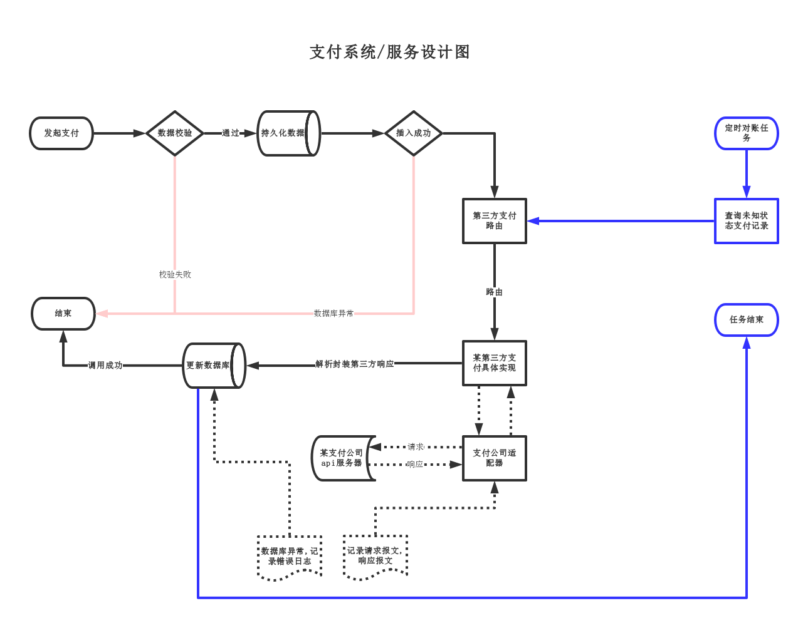

## 项目介绍

　　基于互联网金融理财环境下产生的支付系统,特点为:同卡进出,用户先实名绑定银行卡,后交易,不支持手机扫码交易        
　　提供统一的支付框架,只需少量代码就可快速接入新渠道,提供一个稳定的支付解决方法,节约程序员约会时间,    
　　项目以dubbo服务运行,需要dubbo环境(也可在pay-demo中直接引入服务pay-service.jar,同应用启动)

### 组织结构

``` lua
pay
├── doc -- 一些文档说明,数据库初始化sql,和引用的第三方jar
├── pay-demo -- 客户端调用demo
├── pay-dependency -- 管理maven依赖
├── pay-core -- 基础模块
├── pay-api -- 暴露给外部系统调用api
|    ├── BankService -- 签约绑卡api
|    ├── DbPayService -- 签约绑卡数据库操作api
|    ├── DbBankService -- 支付数据库操作api
|    ├── PaymentService -- 支付api
|    └── PayTaskService -- 支付任务调度api
└── pay-service -- 支付服务实现
     ├── RechargeRoute -- 充值路由简单实现,依据充值限额,和充值费率自动路由
     ├── ThirdBankRoute -- 第三方签约绑卡路由
     ├── ThirdPayRoute -- 第三方支付路由
     ├── PaymentTransaction -- 支付记录事务控制
     └── PaymentValidate -- 数据校验
```

### 技术选型

　　MyBatis  
　　Druid  
　　ZooKeeper  
　　Dubbo  
　　Redis   用于缓存, 和分布式锁  
　　lucene   用户支行信息索引  
　　Log4J  
　　json  
　　Maven  

#### 架构图



### 联系我

　　QQ : 740248117  
　　Q群: 546609201  
	欢迎加入我们交流学习    


